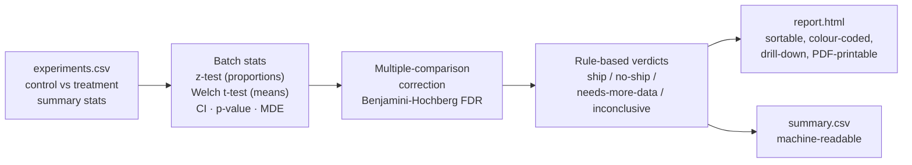

# experiment-analysis-pipeline

[](https://github.com/smbochkarev1/experiment-analysis-pipeline/actions/workflows/tests.yml)
[](https://www.python.org/)
[](LICENSE)

**Batch-analyze dozens of A/B experiments in one command and get a single, sortable HTML report with a ship / no-ship verdict for each one.**

Feed it a table of experiment summary statistics → it runs the right significance test per metric, corrects for multiple comparisons across the whole batch, assigns a rule-based verdict, and renders a self-contained interactive report you can open in a browser or print to PDF.

```bash
python analyze.py --input examples/experiments.csv
# -> output/report.html  +  output/summary.csv
```

---

## 1. Problem

An analyst running **dozens of parallel A/B experiments** ends up hand-reviewing each one: pulling numbers, running a test, eyeballing a p-value, deciding whether it shipped. That does not scale, and it invites three classic mistakes:

- **Multiple comparisons** — with 30 experiments at α = 0.05 you expect ~1.5 false "winners" by chance alone. Judging each test in isolation manufactures fake wins.
- **Statistical vs. practical significance** — a huge sample can make a +0.3% uplift "significant" and worthless.
- **Underpowered reads** — calling a small-sample flat result a "loss" when the test simply couldn't detect anything.

This pipeline turns that manual, error-prone loop into one reproducible pass over a CSV.

## 2. How it works



Each experiment gets: the correct two-sample test for its metric type, a confidence interval on the effect, a raw and a **BH-adjusted** p-value, a minimum-detectable-effect (MDE) reference at 80% power, and a verdict with a plain-English reason and guardrail flags.

## 3. Example

The bundled demo (`examples/experiments.csv`) has **30 synthetic experiments** spanning every realistic outcome. Running the pipeline yields **14 ship · 4 no-ship · 3 needs-more-data · 9 inconclusive**. A few rows straight from the generated `summary.csv`:

| Experiment | Metric | Uplift | p (raw) | p (BH) | Verdict | Why |
|---|---|---|---|---|---|---|
| One-click reorder | proportion | **+18.8%** | 1.8e-11 | 5.8e-11 | 🟢 **ship** | Significant after correction, large effect in the desired direction |
| Ads density +2 slots | mean | **−5.3%** | 5e-282 | 5e-281 | 🔴 **no_ship** | Significant regression — wrong direction |
| Price rounding .99 | mean | +0.35% | 4e-08 | 1e-07 | ⚪ **inconclusive** | Statistically significant but below the 0.5% practical floor |
| Referral nudge (pilot) | proportion | +32.7% | 0.108 | 0.147 | 🟠 **needs_more_data** | Underpowered (n = 800/arm); absence of signal is uninformative |

The **HTML report** (`examples/output/report.html`) shows a summary-count header, a table sortable by any column (click a header), colour-coded verdict badges and a significance dot, a search/verdict filter, and a click-to-expand drill-down per experiment with the full test details, CI, MDE and flags. It is fully self-contained (inline CSS/JS, no CDN) and prints cleanly to PDF with all drill-downs expanded.

## 4. Quickstart

```bash
python -m venv .venv && source .venv/bin/activate
pip install -r requirements.txt

# regenerate the synthetic demo data (optional, reproducible seed)
python examples/make_synthetic_data.py

# run the pipeline
python analyze.py --input examples/experiments.csv
open output/report.html            # macOS  (xdg-open on Linux)
```

Options: `--outdir` (default `output`), `--config config.yaml`, `--template templates/report.html.j2`.

### Input schema (`experiments.csv`)

| column | meaning |
|---|---|
| `experiment_id` | unique id |
| `name` | human label (optional) |
| `metric_type` | `proportion` (rate in [0,1]) or `mean` (continuous) |
| `control_n`, `treatment_n` | sample size per arm |
| `control_value`, `treatment_value` | conversion rate or mean |
| `control_var`, `treatment_var` | **variances** — required for `mean`, ignored for `proportion` |
| `direction` | `increase` \| `decrease` — the desired direction of the effect |
| `peeks` | optional interim-look count for the peeking guard |

## 5. Design decisions

- **Benjamini-Hochberg over Bonferroni.** With dozens of experiments the real risk is the multiple-comparisons problem. Bonferroni controls the family-wise error rate but is punishingly conservative and would bury genuine wins. BH controls the **false discovery rate** — the expected share of false positives among declared winners — which is the right trade-off when you *want* to surface as many true wins as possible without drowning in noise. Significance is judged on the **adjusted** p-value, not the raw one, so borderline "winners" that only look significant in isolation are correctly demoted (see EXP-019/020 in the demo).
- **Rule-based verdicts, not just p-values.** A p-value alone doesn't tell a PM what to do. The verdict layer combines three questions an experienced analyst always asks — *is it significant after correction? is the effect in the direction we wanted? is it big enough to matter?* — into an explicit, auditable decision. Every threshold lives in `config.yaml`; nothing is hard-coded.
- **Practical-significance floor.** A significant but sub-threshold effect (`min_practical_uplift`) is returned as `inconclusive`, not `ship`. Big samples make trivial effects significant; shipping them is churn without value (see EXP-018).
- **Proportion vs. mean handled separately.** Conversion-style metrics use a two-proportion **z-test** (pooled variance for the test statistic, unpooled Wald SE for the reported CI); continuous metrics use **Welch's t-test**, which does not assume equal variances between arms — the safer default for real product metrics.
- **Peeking guardrail.** Repeatedly checking an experiment and stopping when it looks significant inflates the false-positive rate. If a `peeks` count exceeds the configured limit without alpha-spending, the result is **flagged** (`peeking_no_alpha_spending`) so the reader knows the nominal p-value is optimistic. This is a warning flag, not a full sequential-testing engine — the pipeline works from summary stats, so it cannot re-derive an alpha-spending boundary; it surfaces the risk instead of silently trusting the number.

## 6. Stats notes & assumptions

- **Two-proportion z-test** — normal approximation to the binomial; valid when successes and failures per arm are both large (rule of thumb ≥ 10). Test statistic uses the pooled proportion under H₀: p₁ = p₂; the reported 95% CI on the difference uses the unpooled (Wald) standard error.
- **Welch's t-test** — two-sample t-test with the Welch–Satterthwaite degrees-of-freedom approximation; assumes approximately normal arm means (holds by CLT at realistic sample sizes) and does **not** assume equal variances.
- **MDE** — minimum detectable effect (relative) at the configured power (default 80%) and α, i.e. `(z_{α/2} + z_{β}) · SE`. Reported as context for whether a flat result is trustworthy or just underpowered.
- **Verdicts are decision heuristics, not ground truth.** They encode conventional thresholds; tune `config.yaml` to your team's risk tolerance.
- **All tests are two-sided** and operate on **summary statistics** — no row-level data is needed, which is what makes batch analysis of many experiments cheap.

Validation: the proportion test, Welch test and BH correction are checked against a hand-worked example and against `scipy.stats` independent implementations; all match to numerical precision.

## 7. Tests

The statistical core is covered by a pytest suite (`tests/test_stats.py`) that pins each function to an independently known answer — the two-proportion z-test to a hand-worked textbook example, Welch's t-test to `scipy.stats.ttest_ind(equal_var=False)`, and the BH correction to `scipy.stats.false_discovery_control`. The suite runs in CI on every push (see the badge above).

```bash
pip install -r requirements-dev.txt
pytest -q
```

---

*Synthetic data only — the numbers in `examples/` are simulated for demonstration. The methodology is standard A/B analysis. MIT-licensed.*
